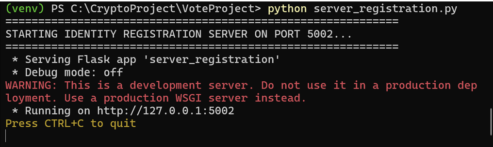
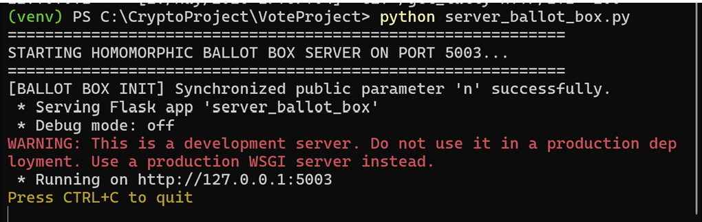
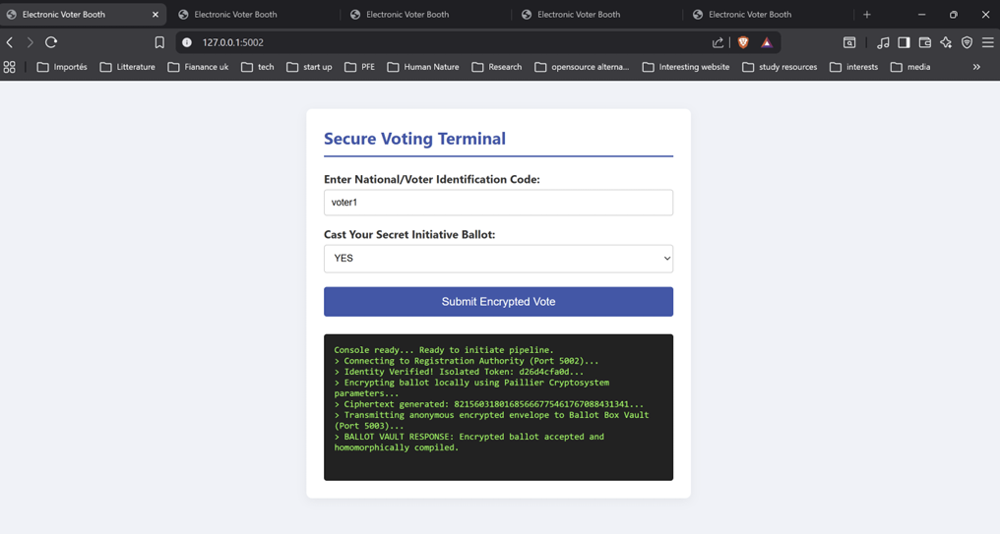
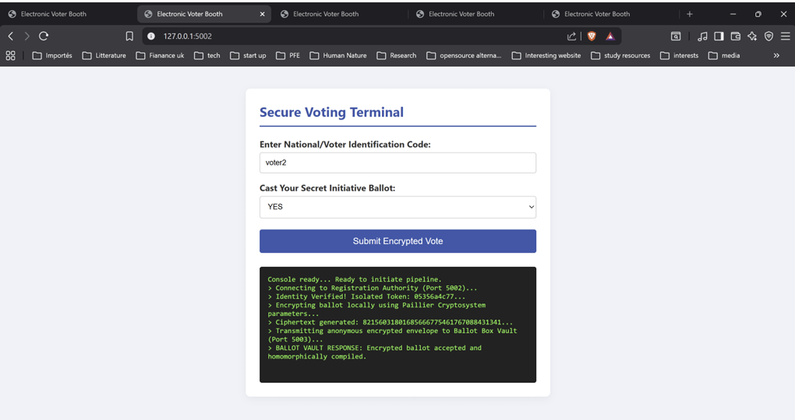
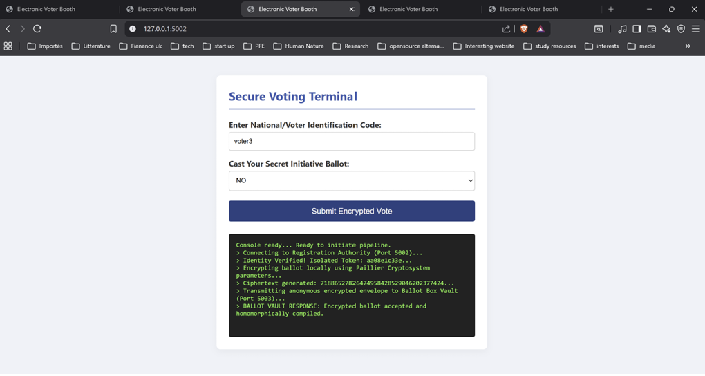
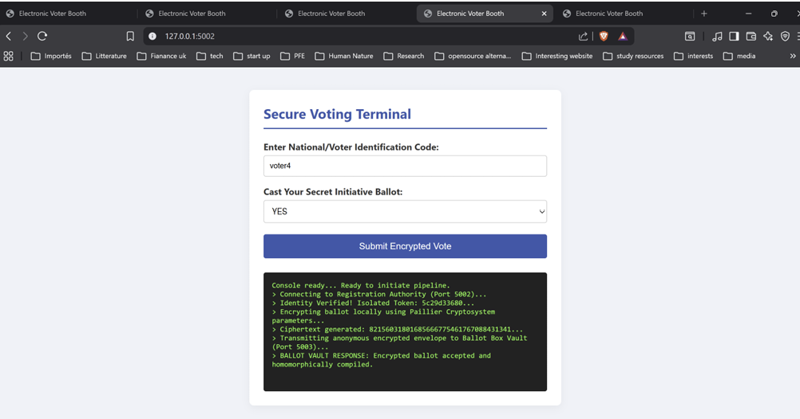
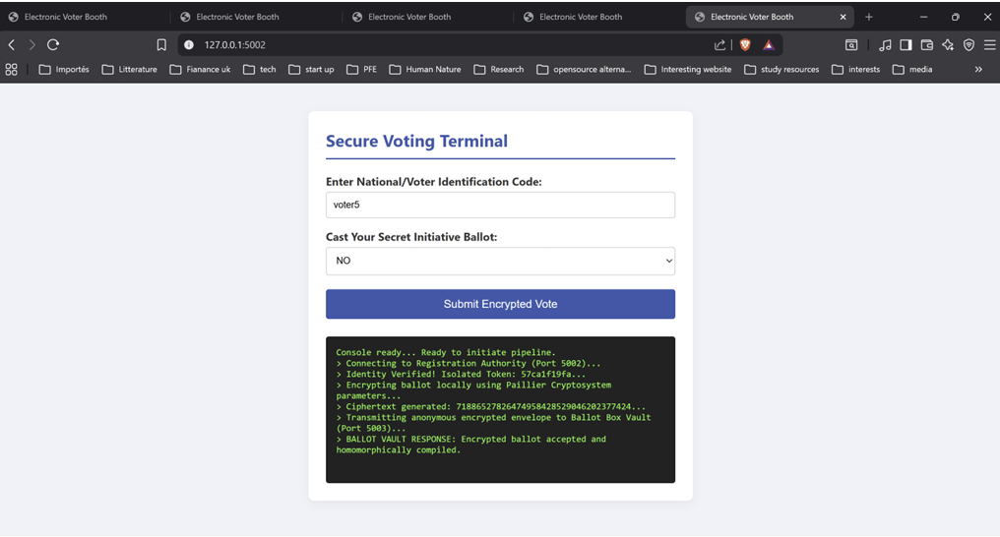
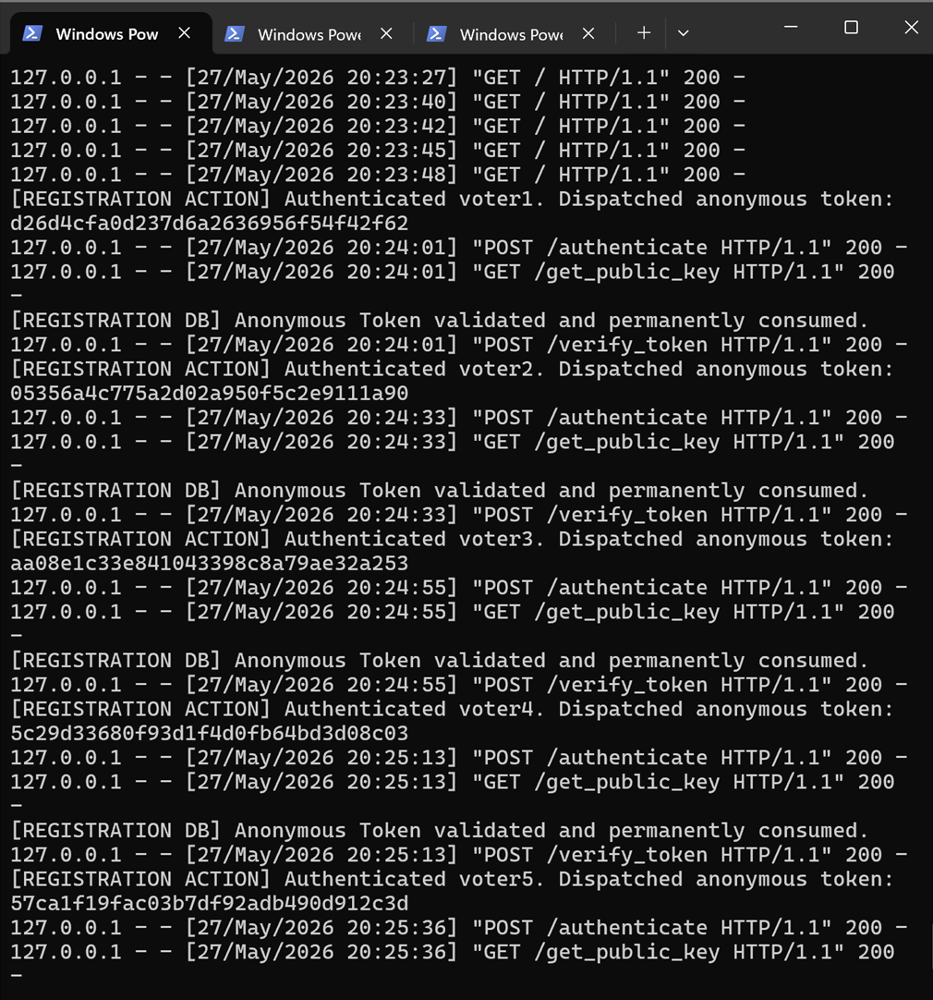
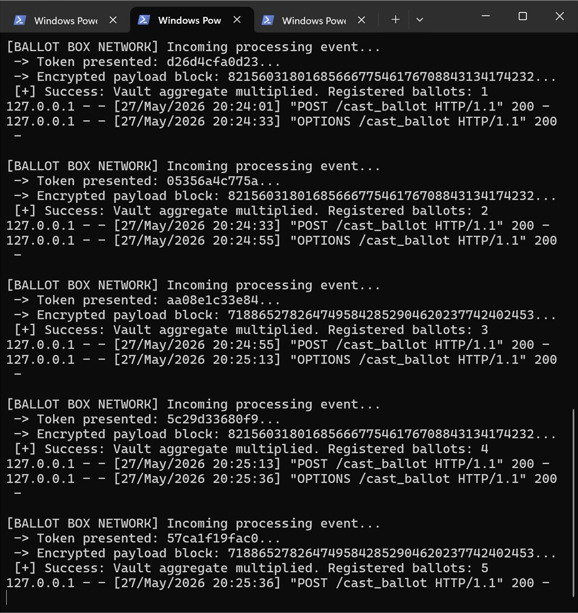
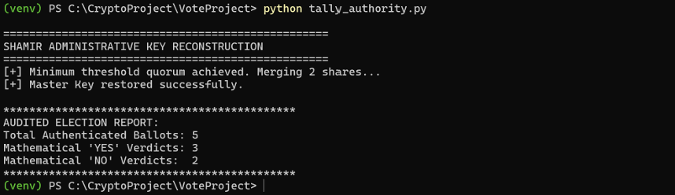

# Homomorphic Electronic Voting System

A secure electronic voting system demonstrating **homomorphic encryption**, **voter identity separation**, and **threshold-based decryption**.

The system is designed to address three fundamental requirements of electronic voting:

* **Single Window** : exactly one vote is authorized per registered voter.
* **Vote Anonymity** : voter identity is separated from the encrypted ballot.
* **Vote Accounting** : every valid encrypted ballot is included exactly once in the final tally.

The system uses the **Paillier cryptosystem** to encrypt individual votes and perform homomorphic aggregation without decrypting individual ballots. **Shamir's Secret Sharing (2,3)** is used to split the Paillier private decryption parameter so that a minimum of two out of three administrative shares are required to perform the final tally.

## 🏗️ System Architecture

The system separates voter identity management, ballot storage, and tally operations into independent logical components.

```text
                         VOTER CLIENT
                    Dynamic Browser Interface
                              │
                              │
                    1. Authenticate
                       & Request Token
                              │
                              ▼
                ┌─────────────────────────────┐
                │  IDENTITY REGISTRATION     │
                │         SERVER A            │
                │      localhost:5002         │
                │                             │
                │ • Voter verification        │
                │ • Eligibility checking      │
                │ • Single-use tokens         │
                └──────────────┬──────────────┘
                               │
                               │ 2. Token validation
                               │    via back-channel
                               ▼
                ┌─────────────────────────────┐
                │     BLIND BALLOT BOX       │
                │         SERVER B            │
                │      localhost:5003         │
                │                             │
                │ • Receives detached ballots │
                │ • Stores ciphertexts        │
                │ • Homomorphic aggregation   │
                │ • No plaintext access       │
                └──────────────┬──────────────┘
                               │
                               │
                               ▼
                ┌─────────────────────────────┐
                │      TALLY AUTHORITY        │
                │                             │
                │ • Reconstructs λ            │
                │ • Requires 2 of 3 shares    │
                │ • Decrypts aggregate        │
                │ • Produces final tally      │
                └─────────────────────────────┘
```

The architecture deliberately separates the identity registration authority from the blind ballot box. The ballot box receives detached inputs consisting of a token and encrypted ballot rather than a directly identifiable voter record.

## 🔐 Security Objectives

### Single Vote Authorization

The registration server maintains the authorized voter registry and issues **single-use cryptographic access tokens**.

The system was tested using five distinct voter profiles, each obtaining an isolated token before submitting a ballot.

### Vote Anonymity

The system separates voter authentication from ballot storage.

The registration server knows which voters authenticate, while the blind ballot box receives encrypted ballot data without access to the identity registry.

The registration server therefore does not receive the voter's selected choice during the voting process.

### Vote Accounting

Encrypted ballots are retained by the ballot box and aggregated homomorphically.

The final tally is obtained by decrypting the aggregate ciphertext rather than individually decrypting every ballot.

# 🖥️ System Components

## Identity Registration Server

**Port:**

```text
5002
```

Responsibilities:

* Maintain the authorized voter database.
* Verify voter identifiers.
* Check voter eligibility.
* Generate single-use cryptographic tokens.
* Keep voter authentication separate from ballot content.

Example startup:

```bash
python registration.py
```

---

## Blind Ballot Box Server

**Port:**

```text
5003
```

Responsibilities:

* Receive detached ballot submissions.
* Validate tokens through the registration server.
* Store encrypted ballots.
* Perform homomorphic aggregation.
* Avoid decrypting individual ballots.

Example startup:

```bash
python ballot_box.py
```

---

## Voter Client

The client interface is accessed through a web browser.

Separate browser tabs can be used to simulate independent voters.

Example:

```text
Browser Tab 1 → voter1
Browser Tab 2 → voter2
Browser Tab 3 → voter3
Browser Tab 4 → voter4
Browser Tab 5 → voter5
```

The client is responsible for:

* voter authentication;
* receiving the access token;
* obtaining the public Paillier parameters;
* encrypting the vote;
* submitting the encrypted ballot.

---

## Tally Authority

The tally component performs the final administrative operation.

Its responsibilities include:

* collecting the required Shamir shares;
* reconstructing the Paillier private parameter;
* decrypting the aggregate ciphertext;
* producing the final election tally.

The individual ballots are not decrypted separately during the tally process.

# 🧪 Testing & Demonstration

The system was tested using five independent voter profiles. 
Each voter completed an independent authentication and encrypted ballot submission process.

## Server Initialization

### Registration Server

The identity registration service is started on localhost:5002.

### Ballot Box

The homomorphic ballot box is started on: localhost:5003.
The ballot box synchronizes the public Paillier parameters required for encrypted ballot processing.

# 👤 Voter Simulation

## Voter 1

The first test voter authenticates and receives a randomized token.

The selected vote is encrypted locally using Paillier encryption before being submitted to the ballot box.
The ballot box receives the resulting ciphertext rather than the plaintext vote.

## Voter 2

The second voter obtains a separate token and submits a separately randomized Paillier ciphertext.

## Voter 3

The third voter performs the same authentication, encryption, and detached ballot submission process.

## Voter 4

The fourth voter receives an isolated authorization token and submits an independently generated encrypted ballot.

## Voter 5

The final test voter completes the authentication and encrypted ballot submission process.

The five encrypted ballots are then available for homomorphic aggregation.

# 🔎 Anonymity Verification

The registration server logs were examined to verify identity/data separation.

The registration logs record authentication activity and randomized tokens but do not record the selected ballot choices.

The ballot box logs, meanwhile, show encrypted ciphertext values and the homomorphic aggregation process rather than plaintext vote selections.

Conceptually:

```text
Registration Server
        │
        ├── voter1 → token
        ├── voter2 → token
        ├── voter3 → token
        ├── voter4 → token
        └── voter5 → token

                 ≠

Ballot Box
        │
        ├── token + ciphertext
        ├── token + ciphertext
        ├── token + ciphertext
        ├── token + ciphertext
        └── token + ciphertext
```

The two types of information are deliberately separated.

---

# 📊 Final Tally

At the end of the polling phase:

```text
Encrypted Ballots
       │
       ▼
Homomorphic Multiplication
       │
       ▼
Grand Ciphertext
       │
       ▼
2-of-3 Shamir Quorum
       │
       ▼
Private Key Reconstruction
       │
       ▼
Paillier Decryption
       │
       ▼
Final Tally
```

The test scenario successfully demonstrates the tallying of the five encrypted client votes without individually decrypting the ballots.


# 📸 Demonstration Screenshots

Project screenshots can be found in the [`images/`](images/) directory.

Recommended evidence:

### Registration Server



### Ballot Box Server



### Voter 1



### Voter 2



### Voter 3



### Voter 4



### Voter 5



### Registration Server Audit



### Ballot Box Aggregation



### Final Tally



# 🎥 Demonstration Video

A complete demonstration of the application is available upon request.


# 📚 Cryptographic Summary

```text
                 VOTER
                   │
                   │ Vote = 0 / 1
                   ▼
          ┌──────────────────┐
          │ Paillier Encrypt │
          └────────┬─────────┘
                   │
                   │ Ciphertext
                   ▼
          ┌──────────────────┐
          │   Ballot Box     │
          │                  │
          │ Homomorphic      │
          │ Aggregation      │
          └────────┬─────────┘
                   │
                   │ Grand Ciphertext
                   ▼
          ┌──────────────────┐
          │ Shamir 2-of-3    │
          │ Key Reconstruction│
          └────────┬─────────┘
                   │
                   │ Reconstructed λ
                   ▼
          ┌──────────────────┐
          │ Paillier         │
          │ Decryption       │
          └────────┬─────────┘
                   │
                   ▼
             FINAL TALLY
```

# 📄 License

All rights reserved. This code is for demonstration purposes only.  


